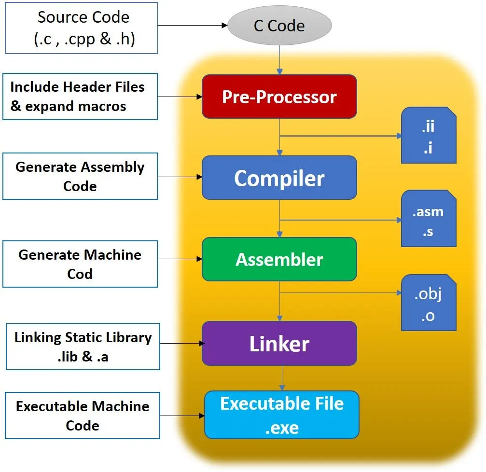

# Linux Build Systems & HPC
## The compilation process
1. pre-processing - comments are stripped, pragmas, defines, and includes are processed
2. compilation - code is converted into it's corresponding assembly
3. assembly - assembly is turned into it's corresponding binary code
4. linking - all required objects and symbols are brought together and an entry-point is made for the binary to be executable.

## The Problem: Linking
- everything is everywhere
- in HPC, usually every package has it's own prefix.
- systems differ
- OS' differ
## The Solution: Build Systems
- abstract the individual compiler commands to make the process adaptable for different environments.
- allow user to specify/override where object files are.
- allow user to specify other build flags, possibly for performance or portability.
## Common Build Systems:
### Autotools
Pros:
- easiest to grasp
- often augmented by pkgconfig
Cons:
- POSIX only
- fairly limited
- inherently dependent on make
### Cmake
Pros:
- many moving parts
- multi-platform
- interchangeable make systems.
- convenient TUI
- can also be augmented by pkgconfig
Cons:
- overly reliant on .cmake files
- at the mercy of the dev to write a good/portable Cmakelist.txt
## What about Make?
- not a build system (exceptions exist)
- simply expedites the running of compile lines
## Examples
### btop
- easy example, mostly relies on bottom-most system libs
### netcdf-c
- has a dependency, some optional
### HPL
- builds against BLAS and MPI
## Compiler flags
- -O(0-3/fast)
- -g
- -funroll-loops
### Example
- John the Ripper