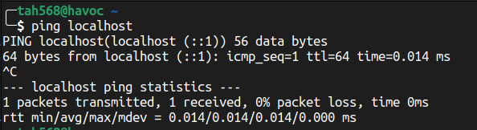
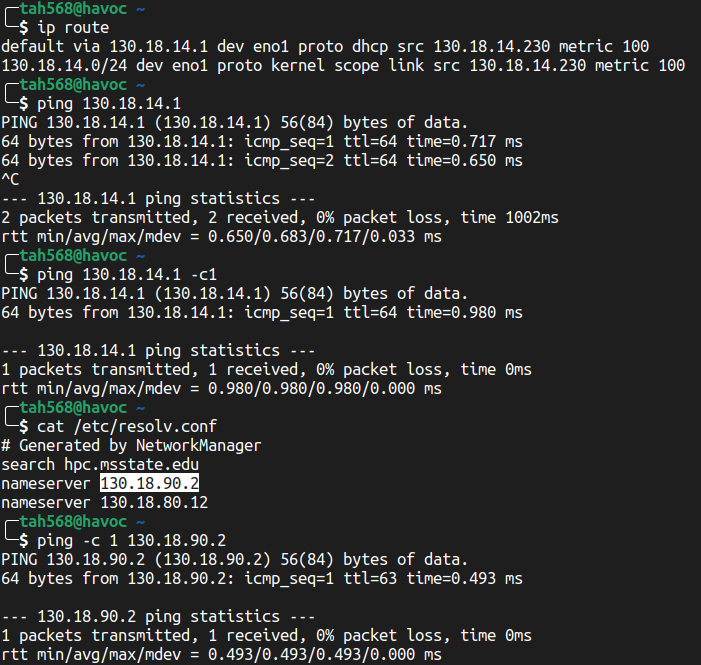
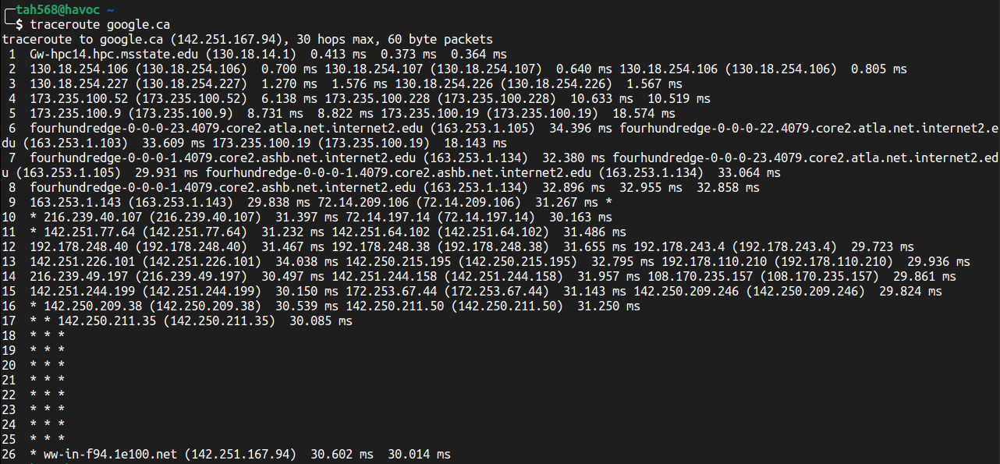
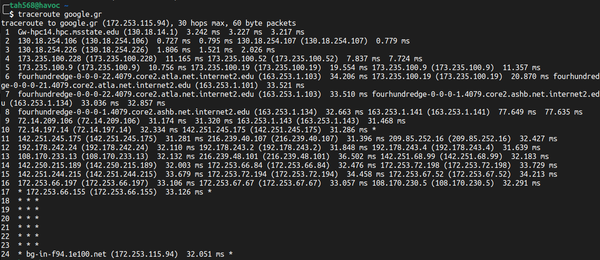

# Homework 1

### Q1.1 Use ping on your workstations to familiarize yourself. List a few of the flags that are used and explain what they do.

- -c count. specify how many packets to send
- -f flood. send pings as fast as possible and tracks how many are lost
- -i interval. specifies how long to wait between pings

### Q1.2 Ping your workstation’s loopback interface (localhost). What command did you use? Was the ping successful? If the ping is successful, then TCP/IP is properly installed and functioning on this workstation. (Provide Screenshot)

- command: `ping localhost`

### Q1.3 Ping your default gateway and your DNS server. What command did you use? (Provide Screenshot)

- ping -c 1 $ADDRESS

### Q1.4 Ping google.com.au, google.gr, and google.ca. What is the IP address of the server you pinged for each site? What are the minimum, average, and maximum round trip times for each? (Provide Screenshot)

| Domain | IP | Min/Avg/Max |
| - | - | - |
| google.com.au | 142.251.111.94 | 31.615/31.679/31.771 |
| google.gr | 172.253.115.94 | 31.984/32.142/32.585 |
| google.ca | 142.251.167.94 | 31.859/31.891/31.936 |

### Q1.5 Use ping to measure Round Trip Time (RTT) for 10 messages of size 512, 724, 1024, and 4072 bytes. Determine which flag to use to ensure your message is not fragmented. Graph the message size versus RTT for:

i) Two hosts on a LAN (two workstations in the lab or in your house)

| size | min | avg | max |
|-|-|-|-|
| 512 | 0.266 | 0.300 | 0.324 |
| 724 | 0.300 | 0.325 | 0.361 |
| 1024 | 0.225 | 0.336 | 0.395 |
| 4072 | 0.359 | 0.411 | 0.471 |

\begin{figure}[h]
\centering
\begin{tikzpicture}
  \begin{axis}[
    width=10cm, height=6cm,
    xlabel={Packet Size}, ylabel={Latency}, title={Packet Size to Latency}
  ]
    \addplot[mark=o] coordinates {
      (512,0.300) (724,0.325) (1024,0.336) (4072,0.411)
    };
  \end{axis}
\end{tikzpicture}
\end{figure}

ii) Two nodes on a WAN (for instance, your workstation and a host in Europe) Analyze your results: Calculate the average and standard deviation for every destination.  Discuss the effects of distance, message size, and their relationship with bandwidth and latency.
- I was unable to get the 4072 bit packet to send to my chosen host no matter which DF flag I used.

| size | min | avg | max | std-dev |
|-|-|-|-|-|
| 512 | 32.024 | 32.086 | 32.148 | 0.036
| 724 | 32.048 | 32.104 | 32.209 | 0.045
| 1024 | 32.077 | 32.121 | 32.227 | 0.045
| 4072 | dnf | | |

\begin{figure}[h]
\centering
\begin{tikzpicture}
  \begin{axis}[
    width=10cm, height=6cm,
    xlabel={Packet Size}, ylabel={Latency}, title={Packet Size to Latency}
  ]
    \addplot[mark=o] coordinates {
      (512,32.086) (724,32.104) (1024,32.121)
    };
  \end{axis}
\end{tikzpicture}
\end{figure}

- distance proportionally affects latency as it takes longer to cross the medium, additionally, a longer distance also usually means more hops. Message size increases the load on the network, affecting queuing and other network factors

### Q1.6 Use the tracert utility on your workstation to find the route to a host:

i) In Toronto: How many hops did it take to reach the destination host? How many ISPs did you traverse?

- Hops: 26
- ISPs: 3? not sure, but it seems that it went from cspire to internet2 and rode it all the way to the local ISP of the host.

ii) In Greece: How many hops did it take to reach the destination host? How many ISPs did you traverse?

- Hops: 24
- ISPs: 3? see above
- I'm thinking that even though I'm using the top-level domains of these places, they're being routed to the nearest local datacenter hub anwyay (caching and other).

Explain the meaning of each column in the output. Analyze your results. (e.g. How many hops did it take to reach the destination host? How many ISPs did you traverse? Why do you see “* * *” on some of the output lines?) (Provide Screenshot)

1. domain (if resolveable)
2. IP
3. RTT times 
4. other ips that answered if load balancing occurred

### Q1.7 Briefly discuss why ping would not necessarily provide an accurate estimate of the round-trip time for packets exchanged by two hosts on the Internet? List at least three other such utilities and briefly describe their use.

- ICMP packets are handled differently by some networks
- the forward and return paths may be different
- alternative: iperf, tcpdump, traceroute
