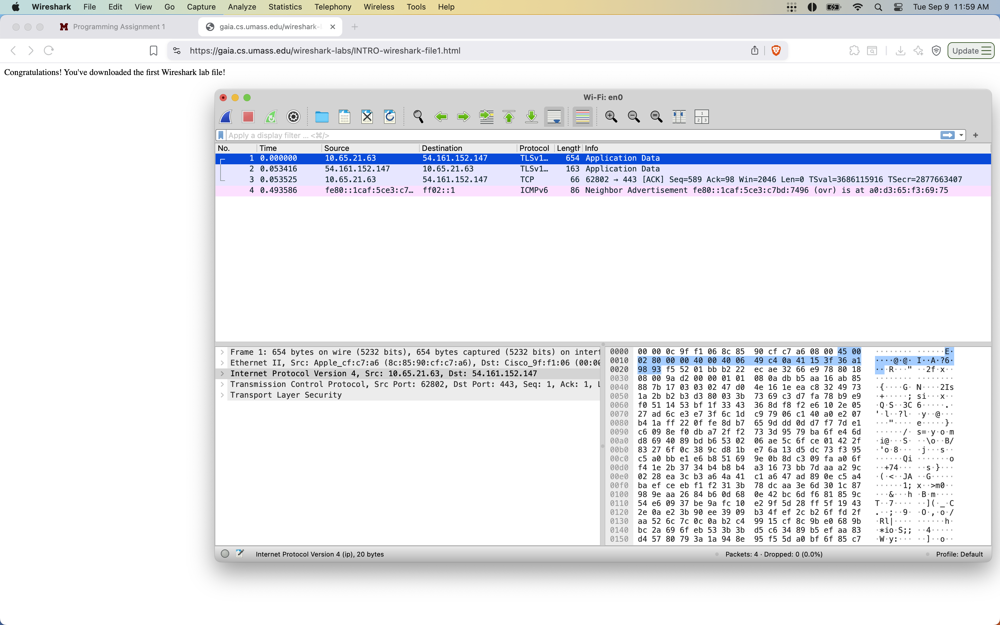

## Module 2: Wireshark

Read the “Intro to Wireshark” document posted on Canvas. Complete the following and provide all answers and related screenshots in a single PDF file using the naming convention: Module_2_Lastname_Firstname.pdf

1. Start up your favorite web browser, which will display your selected homepage.

2. Start up the Wireshark software. Select the appropriate interface and begin packet capture.

3. While Wireshark is running, enter the URL: http://gaia.cs.umass.edu/wireshark-labs/INTRO-wireshark-file1.html and have that page displayed in your browser. In order to display this page, your browser will contact the HTTP server at gaia.cs.umass.edu and exchange HTTP messages with the server in order to download this page, as discussed in section 2.2 of the text. The Ethernet or WiFi frames containing these HTTP messages (as well as all other frames passing through your Ethernet or WiFi adapter) will be captured by Wireshark.

4. After your browser has displayed the INTRO-wireshark-file1.html page (it is a simple one line of congratulations), stop Wireshark packet capture by selecting stop in the Wireshark capture window.

### Q2.1 Which of the following protocols are shown as appearing (i.e., are listed in the Wireshark “protocol” column) in your trace file: TCP, QUIC, HTTP, DNS, UDP, TLSv1.2

- TLSv1 is the main data. 

(Provide Screenshot)?

### Q2.2 How long did it take from when the HTTP GET message was sent until the HTTP OK reply was received? (By default, the value of the Time column in the packet-listing window is the amount of time, in seconds, since Wireshark tracing began. (If you want to display the Time field in time-of-day format, select the Wireshark View pull down menu, then select Time Display Format, then select Time-of-day.)

- About 0.06 seconds

### Q2.3 What is the Internet address of the gaia.cs.umass.edu (also known as www- net.cs.umass.edu)? What is the Internet address of your device that sent the HTTP GET message?

- 54.161.152.147 or that might be mine. not sure.
