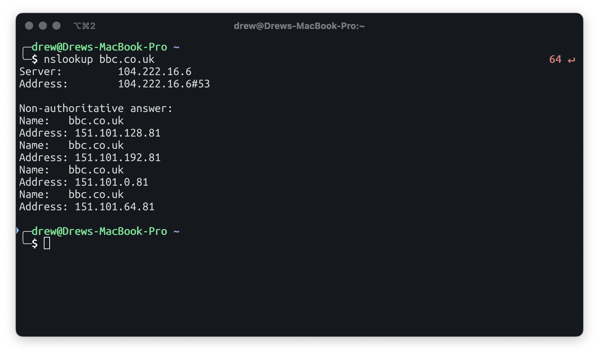
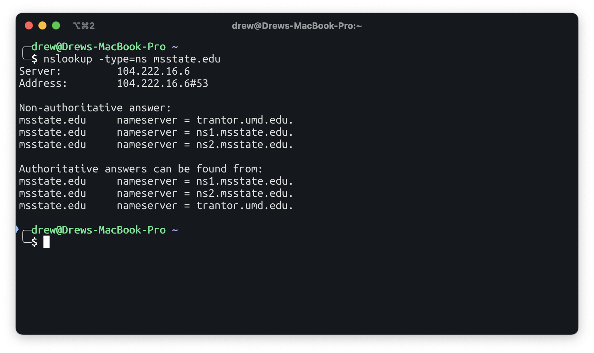
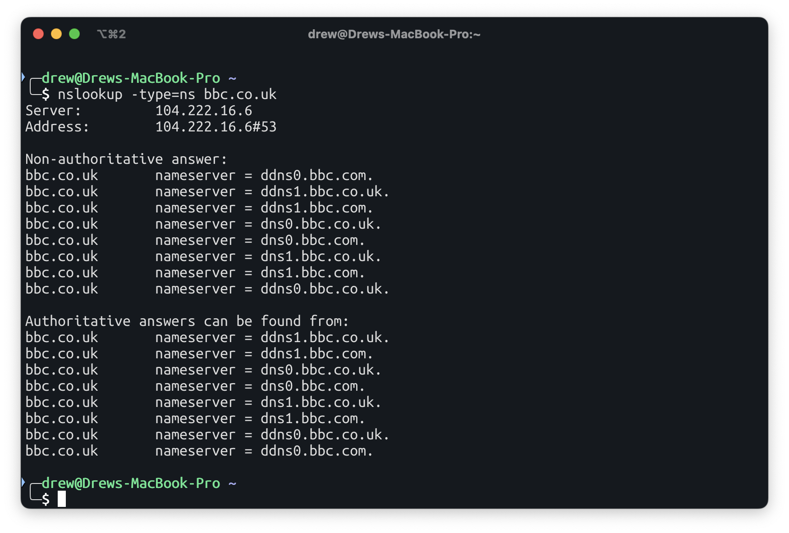
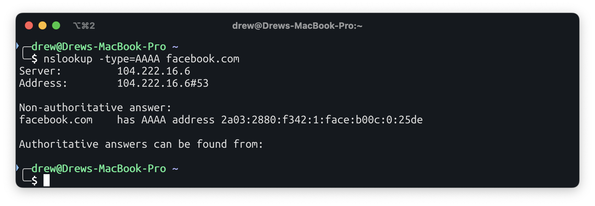

# Module 1: DNS
Drew Helgerson - tah568

Q1.1 Familiarize yourself with the nslookup command. What does it do? What are some of the flags that can be used with this command?
- it's the unix command to query dns servers. the easiest thing is to pass the hostname you want to query, the implementation of nslookup on macos is also extremely barebones

Q1.2 Run nslookup to obtain the IP address of any web server in Europe. What is the IP address of that server? (Provide Screenshot)
- bbc.co.uk - 151.101.128.81 and others

Q1.3 Run nslookup to determine the authoritative DNS servers for our university and another of your choosing that is not in North America. (Provide Screenshot)

Q1.4 Run nslookup so that one of the DNS servers obtained in Question 2 is queried for the mail servers for Gmail. What is its IP address? (Provide Screenshot)
- 142.250.113.17

Q1.5 Use nslookup to find the IPv6 address of facebook.com. Why do some queries return IPv6 addresses (AAAA records) while others don’t? (Provide Screenshot)
- not all dns entries list AAAA records. ipv6 isn't mandatory

Q1.6 Use nslookup to run a reverse DNS lookup. (Provide Screenshot)  

Q1.7 Run a DNS lookup against 8.8.8.8 and against 1.1.1.1. Do the IP addresses differ?
- no, ideally not. I think 1.1.1.1 attempts to prune some unused entries but the one I tried was active.
Explain. (Provide Screenshot)  
![[q1.7.png]]
Q1.8 Show all the DNS entries cached on your local computer. Flush your DNS cache. Show all DNS entries after flushing. (Provide Screenshot) 
- I've been told by the AI overlords that macOS doesn't have a way to show the contents of the dns cache, only to query if something resides in it. 

# Module 2: DNS Wireshark

Ensure that you flush your local DNS cache again before proceeding. Open the browser you use for testing and clear its cache as well. Open Wireshark and start a capture session. Choose a local small business and access its website. Close the capture session and locate the DNS query and response messages.

Q2.1: Provide a screenshot of the DNS messages. Upload your packet capture with your assignment submission.
![[q2.1.png]]
Q2.2: Are the DNS query and response messages sent over TCP or UDP? Q2.3: What IP address are the DNS query messages sent to?
- UDP, 104.222.20.6

Q2.4: Examine the DNS query message. What “Type” of DNS query is it? (Provide Screenshot)
- standard query
![[q2.4.png]]
Q2.5: Does the query message contain any answers? If so, how many? (Provide Screenshot)
- no, none, see screenshot for q2.4

# Module 3: TCP Wireshark

Start up your web browser. Go the http://gaia.cs.umass.edu/wireshark-labs/alice.txt and retrieve an ASCII copy of Alice in Wonderland. Store this as a .txt file somewhere on your computer. Next, go to http://gaia.cs.umass.edu/wireshark-labs/TCP-wireshark-file1.html. Use the Browse button in this form to select the file on your computer that you just created containing Alice in Wonderland. Don’t press the “Upload alice.txt file” button yet. Now start up Wireshark and begin packet capture. Returning to your browser, press the “Upload alice.txt file” button to upload the file to the gaia.cs.umass.edu server. Once the file has been uploaded, a short congratulations message will be displayed in your browser window. Stop Wireshark packet capture. Answer the following:

Q3.1: Provide a screenshot of the packet capture. Upload your packet capture with your assignment submission.
- NOTE: I accidentally lost the original capture. I recaptured the upload, which will be attahed. the images and observations are based on the original capture
![[q3.1.png]]

Q3.2: What is the IP address and TCP port number used by the client computer (source) that is transferring the alice.txt file to gaia.cs.umass.edu?
- 172.17.192.5:53652

Q3.3: What is the IP address of gaia.cs.umass.edu? On what port number is it sending and receiving TCP segments for this connection?
- 128.119.245.12:80

Q3.4 What is the sequence number of the TCP SYN segment that is used to initiate the TCP connection between the client computer and gaia.cs.umass.edu?
- 0

Q3.5 What is the sequence number of the SYNACK segment sent by gaia.cs.umass.edu to the client computer in reply to the SYN?
- 0

Q3.6 What is the sequence number of the TCP segment containing the header of the HTTP POST command?
- 1

Q3.7: Consider the TCP segment containing the HTTP “POST” as the first segment in the data transfer part of the TCP connection.

- At what time was the first segment (the one containing the HTTP POST) in the data- transfer part of the TCP connection sent?
	- Oct  7, 2025 19:31:47.984147000 CDT
    
- At what time was the ACK for this first data-containing segment received?
	- Oct  7, 2025 19:31:48.030979000 CDT
    
- What is the RTT for this first data-containing segment?
	- 0.050s (50ms)
    
- What is the RTT value of the second data-carrying TCP segment and its ACK?
	- roughly the same

# Module 4: TCP Congestion Control
Using the capture from Module 3, select a client-sent TCP segment in Wireshark’s “listing of captured packets” window corresponding to the transfer of alice.txt from the client to gaia.cs.umass.edu. Then select the menu: Statistics->TCP Stream Graph-> Time-Sequence- Graph (Stevens). Answer the following questions:

Q4.1: Provide a screenshot of the graph.  
![[q4.1.png]]
Q4.2: Identify regions in the graph and comment on whether this looks as if TCP is in its slow start phase, congestion avoidance phase, or some other phase.?
- it seems to be congestion avoidance. it's switching between sending alot and slowing down

Q4.3: These groups of segments seem to have some periodicity. What can you say about this periodicity?
- it sends packets in groups of 3-5ish before it backs off